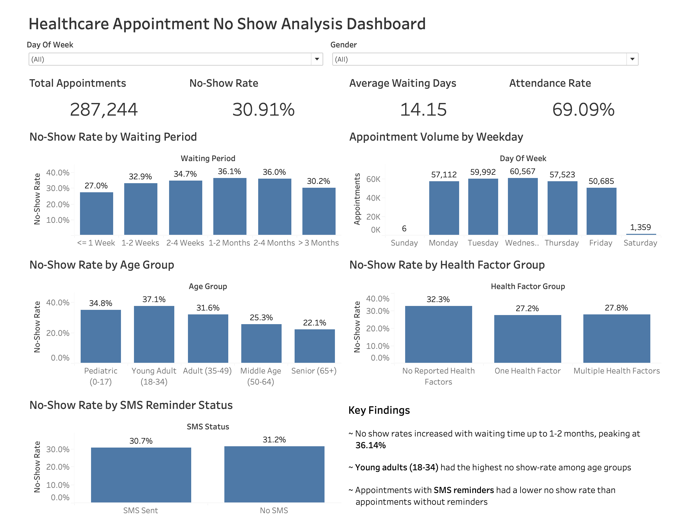

</> Markdown

# Healthcare-Appointment-No-Show-Analysis

</> Markdown

## Project Overview

This project analyzes healthcare appointment data to identify factors associated with patient no-shows and appointment attendance. The analysis focuses on scheduling lead time, appointment trends, patient demographics, reported health factors, and SMS reminders to better understand patterns that may contribute to missed appointments.

The project demonstrates an end-to-end analytics workflow using Excel for data cleaning and validation, MySQL for exploratory and business-focused analysis, and Tableau for interactive data visualization.

</> Markdown

## Tools Used

- **Excel:** Data cleaning, validation, documentation, and PivotTable analysis
- **MySQL:** Data validation, KPI development, segmentation, and exploratory analysis
- **Tableau:** Interactive dashboard development and data visualization

</> Markdown

## Business Questions

The analysis was designed to answer the following questions:

- How does appointment waiting time relate to no-show rates?
- Which waiting periods have the highest no-show rates?
- How do appointment volume and attendance vary by weekday?
- Which patient age groups have the highest no-show rates?
- Does attendance differ by gender?
- How do no-show rate vary by reported health factors?
- Does scholarship status relate to no-show rates?
- How do no-show rates differ for appointments with and without SMS reminders?

</> Markdown

## Tableau Dashboard



</> Markdown

## Data Preparation

The dataset was cleaned and prepared in Excel prior to analysis. Key preparation steps included:

- Removed 6 records containing invalid negative age values
- Converted appointment registration and appointment dates from datetime to date format
- Recalculated appointment waiting time as the number of days between registration and the scheduled appointment
- Reviewed categorical and binary fields for consistency
- Retained the original SMS reminder values (0, 1, and 2), while limiting SMS effectiveness analysis to values 0 and 1
- Documented field definitions and cleaning decisions in a data inventory and cleaning log

</> Markdown

## Analysis

MySQL was used to validate the cleaned dataset, calculate executive KPIs, and investigate factors associated with appointment attendance. The analysis included:

- **Waiting Time:** Compared no-show rates across scheduling lead-time categories and average waiting time for attended versus missed appointments
- **Appointment Trends:** Examined appointment volume, attendance rates, and no-show rates by weekday
- **Patient Demographics:** Compared no-show patterns across age groups and gender
- **Health and Patient Factors:** Evaluated reported health-factor burden, hypertension status, and scholarship status
- **SMS Reminders:** Compared attendance and no-show rates for appointments with and without SMS reminders

</> Markdown

## Key Findings

- Appointments scheduled 1-2 months advance had the highest no-show rate at **36.14%**. No-show rates generally increased with waiting time up to this interval, while appointment scheduled beyond two months represented substantially fewer observations.
- Patient who missed appointments waited an average of **15.57 days**, compared with **13.52 days** for attended appointments
- **Wednesdays** had the highest appointment volume, while **Saturdays** had the highest no-show rate.
- **Young Adults (18-34)** had the highest no-show rate among the age groups analyzed.
- Appointments with **SMS reminders** had a lower no-show rate than appointments without reminders.

</> Markdown

## Limitations

- The analysis identifies associations within the dataset and does not establish casual relationships between the analyzed factors and appointment attendance.
- Appointment volumes were substantially lower for waiting periods beyond two months, limiting comparison with higher-volume scheduling intervals.
- The SMS reminder field contained values 0, 1, and 2. Because the meaning of value 2 was unclear, the SMS effectiveness comparison was limited to values 0 and 1.
- The dataset does not include unique patient or appointment identifier, limiting the ability to distinguish repeat appointments by the same patient.

</> Markdown

## Repository Structure

```text
Healthcare-Appointment-No-Show-Analysis/
├── data/
│   └── healthcare_appointment_no_show_cleaned.csv
├── excel/
│   └── healthcare_appointment_no_show_analysis.xlsx
├── sql/
│   └── healthcare_appointment_no_show_analysis.sql
├── tableau/
│   └── healthcare_appointment_no_show_analysis.twbx
├── images/
│   └── healthcare_appointment_no_show_dashboard.png
└── README.md
```
